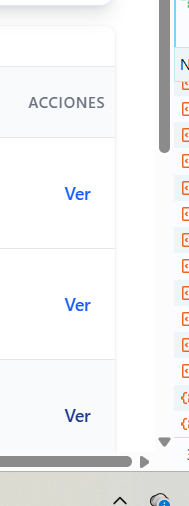

# Modelo de Negocio - Sistema de Gestión de Carpintería

## 1. Descripción General del Negocio

Este sistema está diseñado para gestionar una carpintería que se dedica a la fabricación de muebles y productos de madera, así como a la prestación de servicios de carpintería. El sistema permite administrar todo el ciclo de negocio desde la compra de materiales hasta la venta de productos y servicios, incluyendo el control de inventario, pagos y reportes.

## 2. Actores del Sistema

### 2.1. Propietario
- **Descripción**: Dueño del negocio con acceso completo al sistema
- **Responsabilidades**:
  - Gestión completa de usuarios, productos, servicios e insumos
  - Supervisión de todas las operaciones
  - Acceso a todos los reportes y estadísticas
  - Configuración del sistema

### 2.2. Carpintero
- **Descripción**: Personal técnico que fabrica productos
- **Responsabilidades**:
  - Gestión de productos y servicios
  - Control de insumos y materiales
  - Registro de movimientos de inventario (ingresos y salidas)
  - Actualización de stock durante la producción

### 2.3. Secretaria
- **Descripción**: Personal administrativo que gestiona ventas y atención al cliente
- **Responsabilidades**:
  - Gestión de usuarios (clientes)
  - Creación y seguimiento de pedidos/ventas
  - Registro de pagos
  - Generación de reportes de ventas
  - Atención al cliente

### 2.4. Cliente
- **Descripción**: Usuarios que realizan pedidos de productos o servicios
- **Responsabilidades**:
  - Visualización de productos y servicios disponibles
  - Creación de pedidos
  - Seguimiento de sus pedidos

### 2.5. Proveedor
- **Descripción**: Empresas que suministran materiales e insumos
- **Responsabilidades**:
  - Visualización de compras realizadas
  - Consulta de información de insumos

## 3. Casos de Uso del Sistema

### CU1. Gestión de Usuarios

**Descripción**: Administración de todos los usuarios del sistema según su rol.

**Actores**: Propietario, Secretaria

**Flujo Principal**:
1. El sistema permite crear, editar, eliminar y consultar usuarios
2. Cada usuario tiene un rol asignado (Propietario, Proveedor, Carpintero, Secretaria, Cliente)
3. Los usuarios tienen estados: activo/inactivo, disponible/no disponible
4. Control de seguridad: cuenta no expirada, cuenta no bloqueada, credenciales no expiradas

**Permisos**:
- Propietario: Acceso completo
- Secretaria: Puede crear y editar usuarios (principalmente clientes)
- Otros roles: Solo visualización propia

### CU2. Gestión de Productos

**Descripción**: Administración de productos finales fabricados por la carpintería.

**Actores**: Propietario, Carpintero

**Flujo Principal**:
1. Crear productos con: nombre, descripción, stock, stock mínimo, precio unitario, categoría, imagen
2. Actualizar información de productos
3. Control de stock automático mediante movimientos de inventario
4. Alertas cuando el stock está por debajo del mínimo

**Permisos**:
- Propietario y Carpintero: CRUD completo
- Cliente: Solo visualización

### CU3. Gestión de Servicios

**Descripción**: Administración de servicios ofrecidos por la carpintería (instalación, reparación, diseño, etc.).

**Actores**: Propietario, Carpintero

**Flujo Principal**:
1. Crear servicios con: nombre, descripción, precio base, tiempo estimado, categoría
2. Los servicios pueden ser agregados a pedidos junto con productos
3. Actualización y desactivación de servicios

**Permisos**:
- Propietario y Carpintero: CRUD completo
- Cliente: Solo visualización

### CU4. Gestión de Insumos (Materiales)

**Descripción**: Administración de materiales e insumos utilizados en la producción.

**Actores**: Propietario, Carpintero

**Flujo Principal**:
1. Crear materiales con: nombre, descripción, unidad de medida, precio, stock actual, stock mínimo, punto de reorden, categoría, sector/almacén
2. Control de stock por material
3. Alertas cuando el stock está por debajo del mínimo o punto de reorden
4. Asociación con categorías y sectores de almacén

**Permisos**:
- Propietario y Carpintero: CRUD completo
- Proveedor: Solo visualización

### CU5. Gestión de Inventarios (Ingresos y Salidas)

**Descripción**: Control de movimientos de inventario para materiales y productos.

**Actores**: Propietario, Carpintero

**Flujo Principal**:
1. **Ingresos de Inventario**:
   - Registro de entrada de materiales desde compras
   - Registro de productos terminados al finalizar producción
   - Actualización automática de stock

2. **Salidas de Inventario**:
   - Registro de salida de materiales para producción
   - Registro de salida de productos por ventas
   - Validación de stock disponible antes de permitir salida
   - Actualización automática de stock

3. **Trazabilidad**:
   - Cada movimiento registra: tipo, cantidad, motivo, usuario, fecha
   - Relación con compras y pedidos
   - Historial completo de movimientos

**Permisos**:
- Propietario y Carpintero: Ver, crear ingresos y salidas
- Otros roles: Solo visualización

### CU6. Gestión de Ventas (Contado y Crédito)

**Descripción**: Administración de pedidos/ventas de productos y servicios.

**Actores**: Propietario, Secretaria, Cliente

**Flujo Principal**:

1. **Venta al Contado**:
   - Creación de pedido con productos y/o servicios
   - Cálculo automático de totales
   - Registro inmediato de pago
   - Actualización de stock al confirmar

2. **Venta a Crédito**:
   - Creación de pedido con productos y/o servicios
   - Configuración de cuotas y fechas de vencimiento
   - Seguimiento de pagos pendientes
   - Actualización de stock al confirmar

3. **Proceso de Venta**:
   - Selección de productos/servicios y cantidades
   - Aplicación de descuentos si aplica
   - Selección de método de pago
   - Generación de pedido
   - Registro de movimientos de inventario

**Permisos**:
- Propietario y Secretaria: CRUD completo
- Cliente: Crear pedidos propios

### CU7. Gestión de Pagos

**Descripción**: Administración de pagos de pedidos (contado, crédito, cuotas).

**Actores**: Propietario, Secretaria

**Flujo Principal**:
1. **Pago al Contado**:
   - Registro inmediato al crear pedido
   - Estado: PAGADO

2. **Pago a Crédito**:
   - Creación de registros de pago con fechas de vencimiento
   - Seguimiento de pagos pendientes
   - Registro de pagos parciales o completos
   - Control de cuotas

3. **Estados de Pago**:
   - PENDIENTE: Pago no realizado
   - PAGADO: Pago completado
   - VENCIDO: Fecha de vencimiento pasada sin pago
   - CANCELADO: Pago cancelado

4. **Métodos de Pago**:
   - Efectivo
   - Transferencia bancaria
   - Tarjeta de crédito/débito
   - QR
   - Cheque

**Permisos**:
- Propietario y Secretaria: Ver, crear y registrar pagos

### CU8. Reportes y Estadísticas

**Descripción**: Generación de reportes y análisis del negocio.

**Actores**: Propietario, Secretaria

**Tipos de Reportes**:

1. **Reportes de Ventas**:
   - Ventas por período
   - Ventas por producto/servicio
   - Ventas por método de pago
   - Resumen diario/semanal/mensual
   - Exportación a PDF

2. **Reportes de Compras**:
   - Compras por proveedor
   - Compras por período
   - Resumen de compras
   - Exportación a PDF

3. **Reportes de Inventario**:
   - Stock actual de materiales y productos
   - Alertas de stock bajo
   - Movimientos de inventario
   - Historial de ingresos y salidas

4. **Reportes de Usuarios**:
   - Actividad de usuarios (bitácora)
   - Resumen de acciones por usuario

5. **Estadísticas Generales**:
   - Ventas diarias
   - Productos más vendidos
   - Servicios más solicitados
   - Proveedores principales

**Permisos**:
- Propietario: Acceso a todos los reportes
- Secretaria: Acceso a reportes de ventas y pagos

## 4. Sistema de Roles y Permisos

### 4.1. Roles del Sistema

1. **PROPIETARIO**: Acceso completo a todas las funcionalidades
2. **CARPINTERO**: Gestión de productos, servicios, insumos e inventario
3. **SECRETARIA**: Gestión de usuarios, ventas, pagos y reportes
4. **CLIENTE**: Visualización de productos/servicios y creación de pedidos
5. **PROVEEDOR**: Visualización de compras e insumos

### 4.2. Permisos del Sistema

Los permisos están organizados por módulos:
- `usuarios.*`: Gestión de usuarios
- `productos.*`: Gestión de productos
- `servicios.*`: Gestión de servicios
- `insumos.*`: Gestión de materiales/insumos
- `inventario.*`: Gestión de inventario
- `ventas.*`: Gestión de ventas
- `pagos.*`: Gestión de pagos
- `compras.*`: Gestión de compras
- `reportes.*`: Acceso a reportes
- `configuracion.*`: Configuración del sistema

## 5. Flujos de Negocio Principales

### 5.1. Flujo de Compra de Materiales
1. Secretaria/Propietario crea una compra a un proveedor
2. Se registran los materiales comprados con cantidades y precios
3. Al confirmar la compra, se genera automáticamente un movimiento de INGRESO de inventario
4. El stock de materiales se actualiza automáticamente

### 5.2. Flujo de Producción
1. Carpintero consulta materiales disponibles
2. Carpintero registra SALIDA de materiales para producción
3. Carpintero fabrica el producto
4. Al finalizar, Carpintero registra INGRESO del producto terminado
5. El stock de productos se actualiza

### 5.3. Flujo de Venta
1. Cliente o Secretaria crea un pedido
2. Se seleccionan productos y/o servicios
3. Se calcula el total
4. Se selecciona método de pago (contado o crédito)
5. Si es contado: se registra el pago inmediatamente
6. Si es crédito: se crean registros de pago con fechas de vencimiento
7. Se genera SALIDA de inventario para productos vendidos
8. El stock se actualiza automáticamente

### 5.4. Flujo de Pago a Crédito
1. Secretaria consulta pagos pendientes
2. Cliente realiza pago
3. Secretaria registra el pago
4. Se actualiza el estado del pago a PAGADO
5. Se registra la fecha de pago

## 6. Entidades Principales del Sistema

### 6.1. Usuario
- Información personal y de contacto
- Rol asignado
- Estados de seguridad y disponibilidad

### 6.2. Producto
- Información del producto
- Stock y precios
- Categorización

### 6.3. Servicio
- Descripción del servicio
- Precio base
- Tiempo estimado

### 6.4. Material/Insumo
- Información del material
- Stock y precios
- Ubicación en almacén (sector)

### 6.5. Pedido
- Información del pedido
- Cliente asociado
- Productos y servicios incluidos
- Estado y totales

### 6.6. Pago
- Monto y fechas
- Estado del pago
- Método de pago
- Relación con pedido

### 6.7. Movimiento de Inventario
- Tipo (INGRESO/SALIDA)
- Cantidad
- Material o producto afectado
- Trazabilidad completa

### 6.8. Compra
- Información de compra a proveedor
- Materiales comprados
- Totales y descuentos

## 7. Reglas de Negocio

1. **Control de Stock**: No se pueden realizar salidas de inventario si no hay stock suficiente
2. **Precios**: Los precios pueden variar según el producto/servicio y pueden tener descuentos
3. **Pagos**: Los pagos a crédito deben tener fecha de vencimiento
4. **Usuarios**: Solo usuarios activos pueden acceder al sistema
5. **Inventario**: Todos los movimientos deben ser registrados con usuario responsable
6. **Ventas**: Las ventas pueden incluir productos y servicios en el mismo pedido
7. **Alertas**: El sistema alerta cuando el stock está por debajo del mínimo configurado

## 8. Integraciones y Tecnologías

- **Backend**: Laravel (PHP)
- **Autenticación**: Laravel Sanctum (API Tokens)
- **Base de Datos**: PostgreSQL
- **API**: RESTful API
- **Middleware**: Control de permisos y autenticación

## 9. Seguridad

1. Autenticación mediante tokens (Sanctum)
2. Control de acceso basado en roles y permisos
3. Validación de datos en todas las operaciones
4. Registro de acciones en bitácora
5. Estados de seguridad en usuarios (cuenta no expirada, no bloqueada, etc.)

## 10. Escalabilidad

El sistema está diseñado para:
- Manejar múltiples usuarios simultáneos
- Escalar a múltiples almacenes y sectores
- Agregar nuevos roles y permisos fácilmente
- Expandir funcionalidades sin afectar las existentes
- Generar reportes de grandes volúmenes de datos

---

**Versión**: 1.0  
**Fecha**: Noviembre 2025  
**Sistema**: Gestión de Carpintería Jorge Técno

